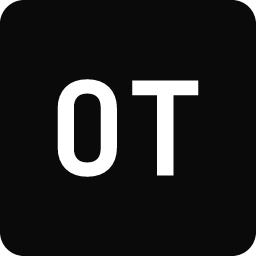

<p align="center">
  
</p>

<h1 align="center">OTerminal</h1>

<p align="center">
  A fast, light terminal and code editor for <a href="https://othcloud.xyz">OTHCloud</a>.<br>
  A fork of <a href="https://github.com/zed-industries/zed">Zed</a>, written in Rust.
</p>

<p align="center">
  <a href="https://github.com/OverTimeHosting/OTerminal-Rust/releases/latest">Download</a> ·
  <a href="./RELEASING.md">Releases &amp; updates</a> ·
  <a href="https://othcloud.xyz">OTHCloud</a>
</p>

---

## What it is

OTerminal is [Zed](https://zed.dev) reshaped around the terminal and OTHCloud:

- **OTHCloud built in**: sign in once, then see your services, dev environments and game servers in the OTHCloud panel, and pull your terminal profiles.
- **Claude Code**: Claude Code runs in its own panel and in tabs using your own Claude Code login, with task titles, a thread dropdown, notifications, and an **Agents dashboard** that shows every session, its sub-agents and background commands.
- **Project tabs**: several projects in one window. A project you switch away from keeps its terminals, unsaved edits and layout, and its extra windows hide and come back as they were.
- **Git & GitHub**: clone from your GitHub accounts (from OTHCloud or stored on this PC), switch accounts, branches and worktrees from the title bar.
- **Light by default**: no telemetry, no collaboration or Zed AI extras, the OTHCloud look (JetBrains Mono, OTHCloud Dark/Light).
- **Updates itself** from this repository's GitHub releases.

OTerminal 2.x is the Rust line. The earlier VS Code-based OTerminal (1.x) lives in [OverTimeHosting/Oterminal](https://github.com/OverTimeHosting/Oterminal).

## Install

Download `OTerminal-<version>-windows-x86_64-setup.exe` from the [latest release](https://github.com/OverTimeHosting/OTerminal-Rust/releases/latest) and run it. After that, OTerminal updates itself: it checks for new releases at startup and every few hours and shows **Restart to Update** in the title bar.

The installer isn't code-signed yet, so Windows SmartScreen may warn on the first install ("More info" → "Run anyway").

Windows x64 only for now; macOS and Linux builds are planned.

## Build from source (Windows)

Requirements: [rustup](https://rustup.rs) (the toolchain in `rust-toolchain.toml` is installed automatically), Visual Studio 2022 Build Tools with the C++ workload and a Windows 10/11 SDK, CMake, and Git.

```powershell
git clone https://github.com/OverTimeHosting/OTerminal-Rust.git
cd OTerminal-Rust
cargo run -p zed                 # debug build, starts target\debug\oterminal.exe
cargo build --release -p zed -p cli
powershell -File script/bundle-windows.ps1   # installer
```

Zed's own build guides still apply for the details: [Windows](./docs/src/development/windows.md), [macOS](./docs/src/development/macos.md), [Linux](./docs/src/development/linux.md).

## Releases

Every push to `main` bumps the version in `OTERMINAL_VERSION`, builds the Windows installer and publishes a GitHub release. See [RELEASING.md](./RELEASING.md) for how it works, the self-hosted runner option and the updater.

## Where things live

| Area | Code |
| --- | --- |
| OTHCloud API, sign-in, deep link | `crates/othcloud_client` |
| OTHCloud panel | `crates/othcloud_panel` |
| GitHub accounts, clone, git credentials | `crates/othcloud_github`, `crates/git/src/credential_override.rs` |
| Terminal profiles, Claude Code sessions | `crates/othcloud_terminal_profiles` |
| Project tabs and project windows | `crates/project_tabs`, `crates/workspace/src/multi_workspace.rs` |
| Claude Code panel, tabs, titles | `crates/agent_ui` |
| Agents dashboard | `crates/agents_dashboard` |
| Updater | `crates/auto_update` |
| Theme and logo | `assets/themes/othcloud`, `assets/images` |

## License

OTerminal is a fork of [Zed](https://github.com/zed-industries/zed) by Zed Industries. Like Zed, its source code is licensed primarily under **GPL-3.0-or-later** ([LICENSE-GPL](./LICENSE-GPL)), with Apache-2.0 components where marked ([LICENSE-APACHE](./LICENSE-APACHE)). OTerminal's changes are released under the same terms.

"Zed" is a trademark of Zed Industries; OTerminal is not affiliated with or endorsed by Zed Industries.

Third-party dependency licenses are collected with [`cargo-about`](https://github.com/EmbarkStudios/cargo-about) (`script/licenses/zed-licenses.toml`). If that check fails for a crate you added, set `publish = false` under `[package]` in its `Cargo.toml`.
